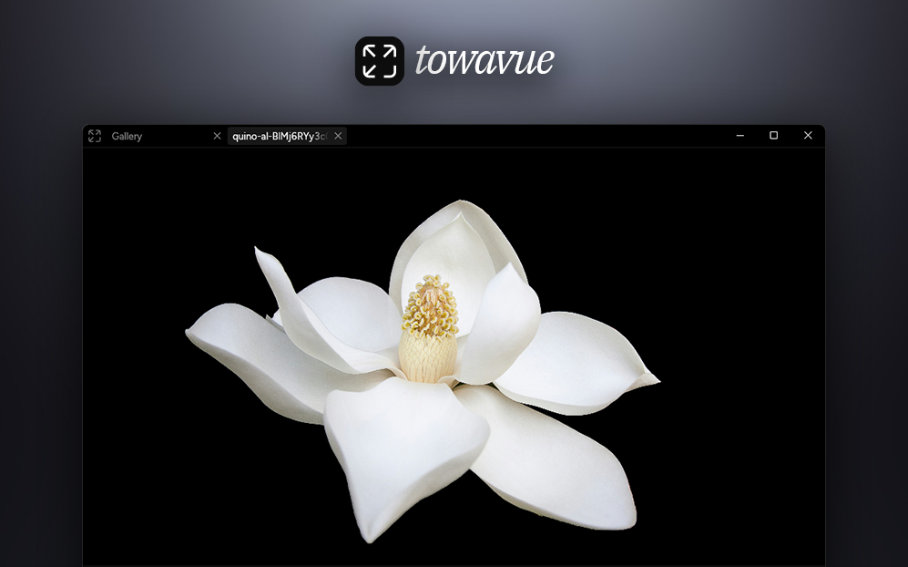

  <a href="https://sheetau.github.io/towavue/">Website</a>
  ·
  <a href="https://github.com/sheetau/towavue/releases">Releases</a>
  ·
  <a href="https://github.com/sheetau/towavue/blob/main/docs/DEVELOPMENT.md">Development</a>

<h1></h1>

**All your media. One fast, beautifully minimal Windows app.**

Browse images, watch videos, and listen to music in a single, fluid workspace. Built in Rust with native GPU rendering, towavue brings speed, a modern tabbed interface, and non-destructive editing together, with your files in the same order as Explorer.

**[Download for Windows 11 x64](https://github.com/sheetau/towavue/releases/latest)**

## Features

- **Images, video, and audio, together.** Keep your media in tabs, or move tabs between windows with edits and playback state intact.
- **Built for responsive viewing.** GPU rendering powers the interface and media display. Supported hardware-decoded video stays on the GPU through presentation, avoiding frame copies back to the CPU.
- **Browse in the order you expect.** Follow Explorer's folder order, jump through thumbnail filmstrips, and revisit recent files in the gallery.
- **A comfortable reading view.** Connect images into pages, choose the layout and reading direction, and settle into fullscreen.
- **Edit without leaving the viewer.** Crop, rotate, and resize images; trim video and audio, adjust speed and gain, or save a video frame. Work non-destructively, with undo available even after saving.

## Getting started

Download the latest `windows-x64-setup.exe` from [Releases](https://github.com/sheetau/towavue/releases/latest) and run it. Setup installs for the current user and includes the Visual C++ prerequisite if needed. **Windows 11 x64** is required. The EXE and Setup are currently unsigned, so Windows may show an unknown-publisher warning.

Open a file or folder, or drag media from Explorer. To make towavue your default viewer, use **Settings > Apps > Default apps > towavue**, or **Open with > Choose another app > Always**. Files open in new tabs in the last active window; **Show more options > Open in new towavue window** opens a separate window.

Updates are checked automatically, or through **Help > Check for updates**. After download and signature verification, choose **Install now** or **Install on next launch**. Close towavue before running Setup manually.

## Media support

Images include PNG, APNG, JPEG, GIF, WebP, BMP, TIFF, and AVIF, including supported animations. FFmpeg provides broad video and audio support, including MP4, MKV, WebM, MP3, FLAC, WAV, and Opus. Codec and profile support depends on the file; export formats have their own color, timing, and animation limits. Viewing a format does not guarantee lossless export to it. HDR tone mapping and embedded ICC profile conversion are not currently supported.

## Useful shortcuts

| Action                                                                 | Shortcut                                                                  |
| ---------------------------------------------------------------------- | ------------------------------------------------------------------------- |
| Toggle filmstrip / reading mode / timeline                             | F / B / T                                                                 |
| Previous / next file in the folder, across media types                 | Alt+Left / Alt+Right                                                      |
| Previous / next file of the same media type                            | Ctrl+Left / Ctrl+Right                                                    |
| Crop the image selection / keep only the selected video or audio range | Ctrl+Y                                                                    |
| Set the time selection's start / end at the playhead                   | I / O                                                                     |
| Raise / lower playback volume                                          | Wheel up / down over the video or audio view (outside the audio playlist) |
| Previous / next video frame                                            | `,` / `.`                                                                 |
| Decrease / increase playback speed                                     | `Ctrl+,` / `Ctrl+.`; reset with `/`                                       |

Shortcuts depend on the active media and mode. Menus show available commands; customize bindings in **Keyboard Shortcuts** (Ctrl+K Ctrl+S).

## License and source

Created by **sheeta**. Current development toward 1.0.3 and later is licensed under [Apache License 2.0](LICENSE-APACHE); see [NOTICE](NOTICE). Third-party components retain their own licenses; see [third-party notices](third-party/README.md).

Each release includes a matching `sources.zip` with application and native sources, patches, and original notices. **Help > Show licenses and sources** opens the installed notices and source link. For building and contributing, see the [development guide](docs/DEVELOPMENT.md).
